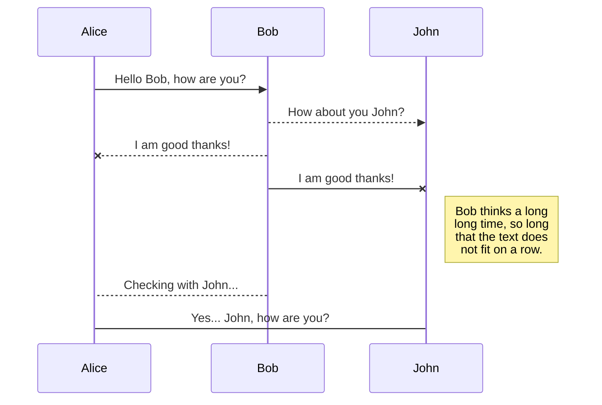
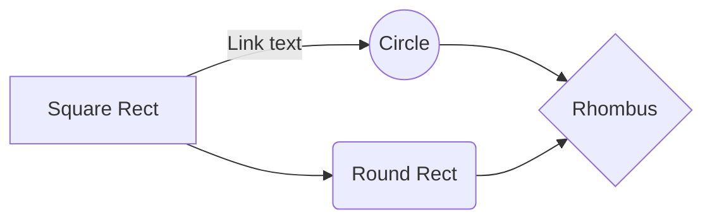

# heading 1
This is paragraph about MarkDown. which topic should we covered in MarkDown.

This is paragraph about MarkDown. which topic should we covered in MarkDown.

This is paragraph about MarkDown. which topic should we covered in MarkDown.

This is paragraph about MarkDown. which topic should we covered in MarkDown.


___


## heading 2 
This is paragraph about MarkDown. which topic should we covered in MarkDown.

This is paragraph about MarkDown. which topic should we covered in MarkDown.

This is paragraph about MarkDown. which topic should we covered in MarkDown.

This is paragraph about MarkDown. which topic should we covered in MarkDown.


___

### heading 3
This is paragraph about M
arkDown. which topic should we covered in MarkDown.

This is paragraph about MarkDown. which topic should we covered in MarkDown.

This is paragraph about MarkDown. which topic should we covered in MarkDown.

This is paragraph about MarkDown. which topic should we covered in MarkDown.

___


**Bold**

*Italic*

> This is blockquotes

1. This is list item 1.
2. This is another list item 2.

- This is list item 1.
- This is another list item 2.


` #include <studio.h> `
```JSON

{
  "firstName": "John",
  "lastName": "Smith",
  "age": 25
}


```

```Javascript

console.log("Hello world");
function heloo(){
    log("HEllo world");
}

```
 
[twitter](https://twitter.com/.
)

<!--  -->


- [x] this is a task.
- [ ] this is a task.

| syntax | description |
| --- | --- |

# Code Formatting 
Inline: Use Javascript `map()` on arrays. 

## Order List
1. item A
2. item B
3. item C


## Unorder list
- item A
- item B
- item C

## Fonts

*Italic*

**Bold**

**mix** *and* **Match**

~~Strikethrough text~~

***Bold and Italic***


Fenced code block:

```Js
const sum = (a, b)=> a + b

sum(2,2)
```


```JSON

{
  "firstName": "John",
  "lastName": "Smith",
  "age": 25
}

```


# Blockquote

> This is a blockquote.

> This is 2nd blockquote.


> This is a blockquote.
>
> This is 2nd blockquote.
 

> This is a blockquote.
>
> >This is 2nd blockquote.
 

## Links

[Mappls](https://www.mappls.com/ "for learning purpose")

[Mappls](#Mappls)


[Mappls][cs]

[cs]: https://www.mappls.com "for learning purpose"

# Images


# Table

| Packages | Description | Version |
| --- | --- | --- |
| express | Web framework | 4.18.1 |
| react | UI library | 18.2.0 |
| webpack | Module bundler | 5.74.0 |


# Table 
| Packages  | Description    | Version |
|-----------|----------------|---------|
| express   | Web framework   | 4.18.1  |
| react     | UI library      | 18.2.0  |
| webpack   | Module bundler  | 5.74.0  |


```JSON
{
"Name" : "Vandana"
"Age" : 24
}
```

> **NOTE :** This is a note.


## UML diagrams

You can render UML diagrams using [Mermaid](https://mermaidjs.github.io/). For example, this will produce a sequence diagram:






